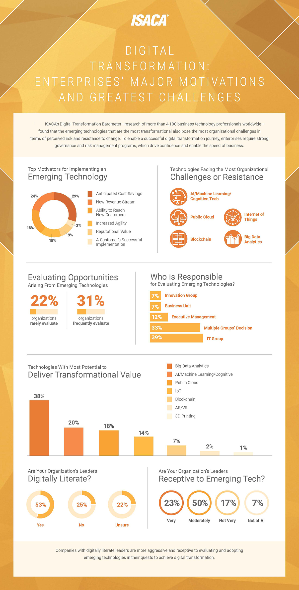

# D3.js-visualisation
[](https://app.netlify.com/sites/d3-visualisation-zainuddin/deploys)


#### Supported Web browsers:


## Overview:

D3 visualisation dashboard containing following charts: doughnut, bar, and radar charts. 

| Description | URL|
| -- | -- |
| Deployed Site | https://d3-visualisation-zainuddin.netlify.app/ |
| Project Code  | https://github.com/Zain-Saiyed/D3.js-visualisation/tree/main/Code |

## Project structure:

The `Code` folder contains the program for realising the d3-visualisation.
```
-- Folders --

D3.js-visualisation/
└───Code/
    ├───assets/
    ├───css/
    ├───payload-data/
    └───js/
        ├───svg-charts/
        └───utils/
```

**Folders:**

1. `Code/` : Main directory containing the entire code base.
2. `assets/`: contains the static image assets/files used in the d3 visualistion dashbaord.
3. `css/`: contains the css files used in the project.
4. `payload-data`: contains data for the charts.
5. `js/`: contains all the javascript files used for visualising the d3 svg(s), legends, and texts.

    a. `svg-charts/`: conatins the javascript files which create the multiple visualisations on the canvas.
    
    b. `utils/`: contains the javascript file containing functions which are commonly/repeatedly used to replicate charts multiple times.


**Expanded view of the Repository contents:**
```
D3.js-visualisation/
│   README.md
│   start_server.bash
│   start_server.bat
│   TargetImage.jpg
│
└───Code/
    │   index.html
    │   index.js
    │
    ├───assets/
    │       background.jpg
    │       image1.jpg
    │       image2.jpg
    │       image3.jpg
    │       image4.jpg
    │       image5.jpg
    │
    ├───css/
    │       style.css
    │
    └───js/
        │   config.js
        │   d3.v7.js
        │
        ├───svg-charts/
        │       chart-1.js
        │       chart-2.js
        │       chart-3.js
        │       chart-4.js
        │       chart-5.js
        │       chart-6.js
        │       chart-7.js
        │       chart-8.js
        │       footer-text.js
        │       header-text.js
        │
        └───utils/
                helper.js
```

## Interactivity:

The top-left most doughnut chart ("**Top Motivators for Implementing an Emerging Technology**") has:
1. Upon hovering the arc is highlighted with a black border of fixed width. 
2. by default the opacity is 0.9, upon hovering full opacity of arc is visible.
3. Load animation is added such that upon page load, the arc are visible after a delay and the legend pops-up from the middle of the chart. 

The top-right most chart ("**Technologies Facing the Most Organizational Challenges or Resistance**") has:
1. Upon hovering the image the image is scaled up by a small factor. SImultaneousy the corresponding text is enlarged as well.
2. Upon moving out of the image, they (image & text) are reverted to their original sizes.

The Second chart on second line ("**Who is Responsible for Evaluating Emerging Technology?**") has:
1. Upon hovering over the bars a border is visible around the bar, corresponding 'percentage text label' and the bar label are highlighted in bold, with font enlargement, and color changed to black for visual clarity.
3. Upon losing focus from the bar, the bar and the text labels are reverted to their original attributes.

The First chart on Third line ("**Technologies With Most Potential to Deliver Transformational Value**") has:
1. Upon hovering over a bar, the bar's border is highlighted in black, corresponding rectangle in legend is highlighted, And, its text labels are made bold adn enlarged for clarity.
2. Upon moving out from the bar, the chart is reverted to its original attributes. 

The bottom-left most chart ("**Are Your Organization’s Leaders Digitally Literate?**") has:
1. Upon hovering the charts the percentage label text font size is enlarged and weight is made to bold.
2. Upon moving out of the chart area, the label's are reversed to their original text attributes.

The bottom-right most chart ("**Are Your Organization’s Leaders Receptive to Emerging Tech?**") has:
1. Upon hovering the charts the percentage label text font size is enlarged and weight is made to bold.
2. Upon moving out of the chart area, the label's are reversed to their original text attributes.

## NOTE:

Few color elements are not same as the reference TargetImage. For example, the bar chartson line 2 and 3, and the second chart on last line. These charts are coloured based on the intensity value of the data point itself, meaning if the value is high then the corresponding color indicating its bar/circle is darker, and if the value is lowest then the color is the lightest. The reason for this is visual clarity, and easy interpretation of data visualised on the dashboard to avoid ambiguities while reading it. 

Radar plot I have implemented as I was very curious on how it can be implemented using D3. Refering to references and existing implementation became evident as the chart is best visualised using radian angle degree measurement. _(Classic! &pi;, &pi;/2 angle rotations/revolutions around the axis, & angle division/slice calcualtion for each dimension on the radar. It was a amazing referesher to the old mathematical concepts!)_

## Setup:

### Pre-requisite:

1. **Python Installation:**

    _If Python is already installed, please skip this step. else continue._

    For Windows, MacOS & Linux:

    Visit the official Python downloads website ( [Downlaod Python Here](https://www.python.org/downloads/) ), and download and install latest Python by following instructions given on the website.

2. **Download the Project Code:**

    To download the project code follow either step-1 or step-2:

    1. _Clone the repository:_

        Clone the repository by executing the following command:

        ```
        git clone https://github.com/Zain-Saiyed/D3.js-visualisation.git

        cd D3.js-visualisation/
        ```

    2. _Download the repository as .zip:_

        - Click the green **"<> Code"** button on top right corner.
        - then, Click **"Download ZIP"**. 
        - Extract the zip file contents, and open the folder containing the extarcted files.

3. **Start the server:**

    _For Windows OS:_
    - Double click the `start_server.bat` file.

    _For MacOS / Linux based OS:_
    - On terminal run `./start_server.sh` script.

    _The above files will first start a Python HTTP server on `localhost:8000`. Secondly, open a browser navigating to `localhost:8000` to view the project's D3.js visualisations._

    _**NOTE:**_
    
    If in case the browser doesn't open automatically, then alternative solution is to manually open the browser, type `localhost:8000` on the top search bar and hit `Enter`. 

<!-- ## Brief about Interactivity: -->

## References:

1. **Chart-1.js:**

    [1] “Animating D3 donut chart on load,” _Stack Overflow_ [Online]. Available: https://stackoverflow.com/questions/20501067/animating-d3-donut-chart-on-load (accessed Feb. 12, 2024).
    _(Currently commented, Not Used in visualisation showcase.)_

    [2] “Angular D3 understanding attrTween function,” _Stack Overflow_ [Online]. Available: https://stackoverflow.com/questions/54852791/angular-d3-understanding-attrtween-function (accessed Feb. 12, 2024).
    
    [3] “D3.js arc.centroid() Function,” _GeeksforGeeks_ [Online]. Available: https://www.geeksforgeeks.org/d3-js-arc-centroid-function/ (accessed Feb. 12, 2024).
    
    [4] “calculate centroid d3,” _Stack Overflow_ [Online]. Available: https://stackoverflow.com/questions/12068510/calculate-centroid-d3 (accessed Feb. 12, 2024).

2. **Chart-6.js:**
    
    [1] “JavaScript function similar to Python range(),” _Stack Overflow_ [Online]. Available: https://stackoverflow.com/questions/8273047/javascript-function-similar-to-python-range (accessed Feb. 12, 2024).
    
    [2] “D3 Spider Chart Tutorial,” _yangdanny97.github.io_ [Online]. Available: https://yangdanny97.github.io/blog/2019/03/01/D3-Spider-Chart (accessed Feb. 12, 2024).
    
    [3] “Radar Chart D3 V4,” _Gist_ [Online]. Available: https://gist.github.com/alandunning/4c36eb1abdb248de34c64f5672afd857 (accessed Feb. 12, 2024).
    
    [4] “radar-chart-d3/src/radar-chart.js at master · alangrafu/radar-chart-d3,” _GitHub_ [Online]. Available: https://github.com/alangrafu/radar-chart-d3/blob/master/src/radar-chart.js (accessed Feb. 12, 2024).

## Reference Visualisation Inspiration:



## Implemented Visualisation:


---
